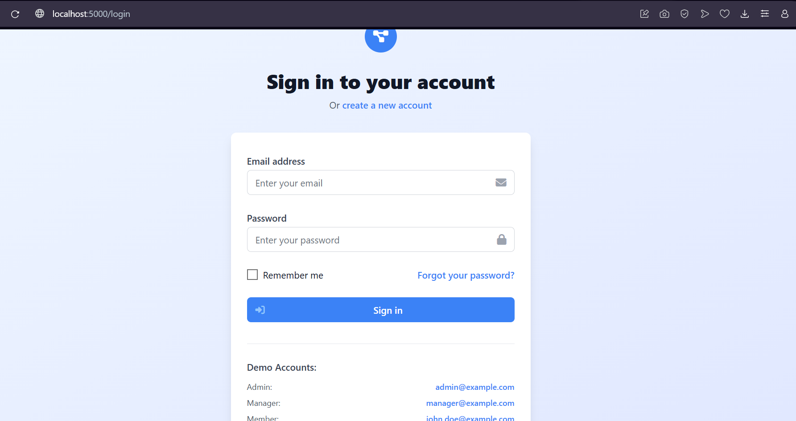

# Project Management API

A comprehensive project management REST API built with Node.js, Express, and PostgreSQL.

## Features

- 🔐 **Authentication & Authorization** - JWT-based auth with role-based access control
- 👥 **User Management** - User profiles, roles, and permissions
- 📋 **Project Management** - Create, update, and manage projects
- ✅ **Task Management** - Full CRUD operations for tasks with assignments
- 💬 **Comments & Collaboration** - Task comments and activity tracking
- 👨‍💼 **Team Management** - Add/remove project members with different roles
- 🔍 **Search & Filtering** - Advanced search and filtering capabilities
- 📊 **Statistics & Analytics** - Project and task progress tracking

## Screenshots

### Login Page


### Dashboard


## Tech Stack

- **Backend**: Node.js, Express.js
- **Database**: PostgreSQL with Sequelize ORM
- **Authentication**: JWT (JSON Web Tokens)
- **Validation**: express-validator
- **Security**: bcryptjs, helmet, cors
- **Development**: nodemon, dotenv
- **Testing**: Jest, supertest

## Quick Start

### Prerequisites

- Node.js (v14 or higher)
- PostgreSQL (v12 or higher)
- npm or yarn

### Installation

1. **Clone the repository**
   ```bash
   git clone <repository-url>
   cd project-manage
   ```

2. **Install dependencies**
   ```bash
   npm install
   ```

3. **Environment Setup**
   ```bash
   cp .env.example .env
   # Edit .env with your database credentials
   ```

4. **Database Setup**
   ```bash
   # Create PostgreSQL database
   createdb project_manager
   
   # Run database seeding (creates tables and sample data)
   npm run seed
   ```

5. **Start the server**
   ```bash
   # Development mode
   npm run dev
   
   # Production mode
   npm start
   ```

The API will be available at `http://localhost:5000`

## API Documentation

### Base URL
```
http://localhost:5000/api
```

### Authentication

All protected endpoints require a JWT token in the Authorization header:
```
Authorization: Bearer <your-jwt-token>
```

### Response Format

All API responses follow this format:
```json
{
  "success": true,
  "data": {},
  "message": "Success message",
  "errors": []
}
```

## API Endpoints

### Authentication Endpoints

#### Register User
```http
POST /api/auth/register
```

**Request Body:**
```json
{
  "email": "user@example.com",
  "password": "password123",
  "firstName": "John",
  "lastName": "Doe",
  "role": "member"
}
```

**Response:**
```json
{
  "message": "User registered successfully",
  "token": "jwt-token-here",
  "user": {
    "id": "uuid",
    "email": "user@example.com",
    "firstName": "John",
    "lastName": "Doe",
    "role": "member"
  }
}
```

#### Login User
```http
POST /api/auth/login
```

**Request Body:**
```json
{
  "email": "user@example.com",
  "password": "password123"
}
```

#### Get Current User
```http
GET /api/auth/me
```
*Requires authentication*

#### Update Profile
```http
PUT /api/auth/me
```
*Requires authentication*

#### Change Password
```http
PUT /api/auth/change-password
```
*Requires authentication*

### Project Endpoints

#### Get All Projects
```http
GET /api/projects?page=1&limit=10&status=active&priority=high&search=ecommerce
```
*Requires authentication*

**Query Parameters:**
- `page` (optional): Page number for pagination
- `limit` (optional): Number of items per page
- `status` (optional): Filter by project status
- `priority` (optional): Filter by priority
- `search` (optional): Search in project name and description

#### Get Single Project
```http
GET /api/projects/:id
```
*Requires authentication*

#### Create Project
```http
POST /api/projects
```
*Requires authentication*

**Request Body:**
```json
{
  "name": "E-commerce Platform",
  "description": "Building a modern e-commerce platform",
  "status": "planning",
  "priority": "high",
  "startDate": "2024-01-01",
  "endDate": "2024-06-30",
  "budget": 50000.00
}
```

#### Update Project
```http
PUT /api/projects/:id
```
*Requires authentication*

#### Delete Project
```http
DELETE /api/projects/:id
```
*Requires authentication*

#### Project Member Management

**Get Project Members**
```http
GET /api/projects/:id/members
```

**Add Member to Project**
```http
POST /api/projects/:id/members
```

**Request Body:**
```json
{
  "userId": "user-uuid",
  "role": "member"
}
```

**Update Member Role**
```http
PUT /api/projects/:id/members/:userId
```

**Remove Member**
```http
DELETE /api/projects/:id/members/:userId
```

### Task Endpoints

#### Get All Tasks
```http
GET /api/tasks?projectId=uuid&status=todo&assigneeId=uuid&page=1&limit=10
```
*Requires authentication*

#### Get Single Task
```http
GET /api/tasks/:id
```
*Requires authentication*

#### Create Task
```http
POST /api/tasks
```
*Requires authentication*

**Request Body:**
```json
{
  "title": "Implement user authentication",
  "description": "Create login and registration functionality",
  "projectId": "project-uuid",
  "status": "todo",
  "priority": "high",
  "assigneeId": "user-uuid",
  "dueDate": "2024-02-01",
  "estimatedHours": 16,
  "tags": ["auth", "security"]
}
```

#### Update Task
```http
PUT /api/tasks/:id
```
*Requires authentication*

#### Delete Task
```http
DELETE /api/tasks/:id
```
*Requires authentication*

#### Add Comment to Task
```http
POST /api/tasks/:id/comments
```
*Requires authentication*

**Request Body:**
```json
{
  "content": "This looks good, but we need to add validation",
  "type": "comment"
}
```

### User Endpoints

#### Get All Users (Admin Only)
```http
GET /api/users?search=john&role=member&page=1&limit=10
```
*Requires admin authentication*

#### Search Users
```http
GET /api/users/search?q=john&projectId=uuid&limit=10
```
*Requires authentication*

#### Get Single User
```http
GET /api/users/:id
```
*Requires authentication*

#### Update User
```http
PUT /api/users/:id
```
*Requires authentication (own profile) or admin*

#### Deactivate User (Admin Only)
```http
DELETE /api/users/:id
```
*Requires admin authentication*

#### Get User's Projects
```http
GET /api/users/:id/projects?page=1&limit=10
```
*Requires authentication*

## Data Models

### User Roles
- `admin`: Full system access
- `manager`: Can create and manage projects
- `member`: Can be assigned to projects and tasks

### Project Statuses
- `planning`: Project is in planning phase
- `active`: Project is actively being worked on
- `on-hold`: Project is temporarily paused
- `completed`: Project is finished
- `cancelled`: Project has been cancelled

### Task Statuses
- `todo`: Task is not started
- `in-progress`: Task is being worked on
- `review`: Task is ready for review
- `done`: Task is completed

### Priority Levels
- `low`: Low priority
- `medium`: Medium priority
- `high`: High priority
- `urgent`: Urgent priority

## Error Handling

The API uses standard HTTP status codes:

- `200` - Success
- `201` - Created
- `400` - Bad Request
- `401` - Unauthorized
- `403` - Forbidden
- `404` - Not Found
- `500` - Internal Server Error

Error responses include detailed error messages:
```json
{
  "message": "Validation failed",
  "errors": [
    {
      "field": "email",
      "message": "Please provide a valid email"
    }
  ]
}
```

## Testing

Run the test suite:
```bash
npm test
```

## Database Seeding

To populate the database with sample data:
```bash
npm run seed
```

This creates:
- 5 test users with different roles
- 4 sample projects
- Multiple tasks and comments
- Project member assignments

**Test Users:**
- `admin@example.com` (Admin)
- `manager@example.com` (Project Manager)
- `john.doe@example.com` (Member)
- `jane.smith@example.com` (Member)
- `bob.wilson@example.com` (Member)

**Password for all test users:** `password123`

## Contributing

1. Fork the repository
2. Create a feature branch
3. Make your changes
4. Add tests for new functionality
5. Submit a pull request

## Health Check

Check if the API is running:
```http
GET /api/health
```

**Response:**
```json
{
  "status": "OK",
  "timestamp": "2024-01-15T10:30:00.000Z",
  "environment": "development"
}
```

## Rate Limiting

The API implements rate limiting to prevent abuse:
- 100 requests per 15 minutes per IP address
- Authenticated users have higher limits

## Security Features

- **Password Hashing**: bcryptjs with salt rounds
- **JWT Tokens**: Secure token-based authentication
- **Input Validation**: Comprehensive request validation
- **SQL Injection Protection**: Sequelize ORM prevents SQL injection
- **CORS**: Configurable cross-origin resource sharing
- **Helmet**: Security headers for Express

## Environment Variables

Required environment variables (see `.env.example`):

```bash
# Server
NODE_ENV=development
PORT=5000

# Database
DB_HOST=localhost
DB_PORT=5432
DB_NAME=project_manager
DB_USER=postgres
DB_PASS=password

# JWT
JWT_SECRET=your-secret-key
JWT_EXPIRES_IN=24h

# Frontend
FRONTEND_URL=http://localhost:3000
```

## Deployment

### Using PM2 (Recommended)
```bash
npm install -g pm2
pm2 start server.js --name "project-manager-api"
pm2 startup
pm2 save
```

### Using Docker
```dockerfile
FROM node:16-alpine
WORKDIR /app
COPY package*.json ./
RUN npm ci --only=production
COPY . .
EXPOSE 5000
CMD ["npm", "start"]
```

## Monitoring

The API includes logging with Morgan middleware. In production, consider:
- Setting up log rotation
- Using external logging services (e.g., Winston, Loggly)
- Implementing health checks and monitoring

## License

This project is licensed under the MIT License.
